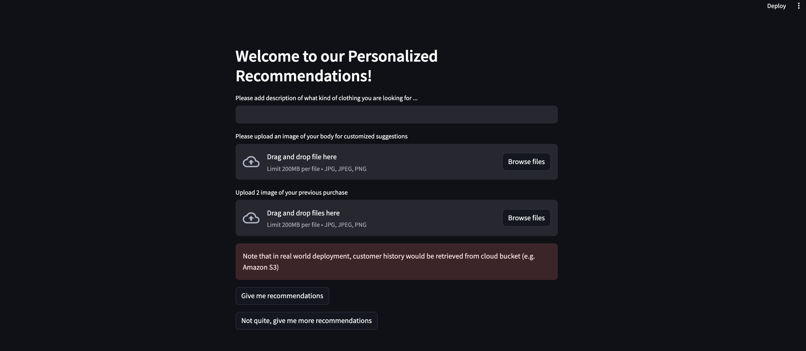
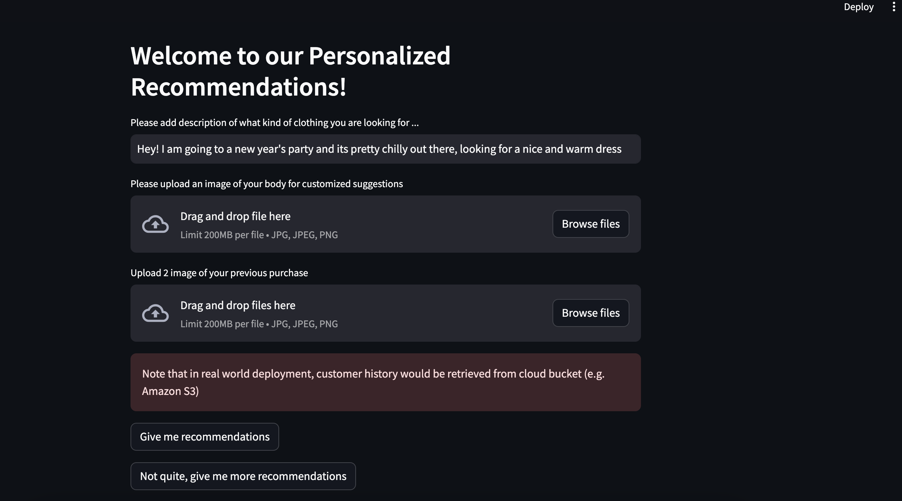
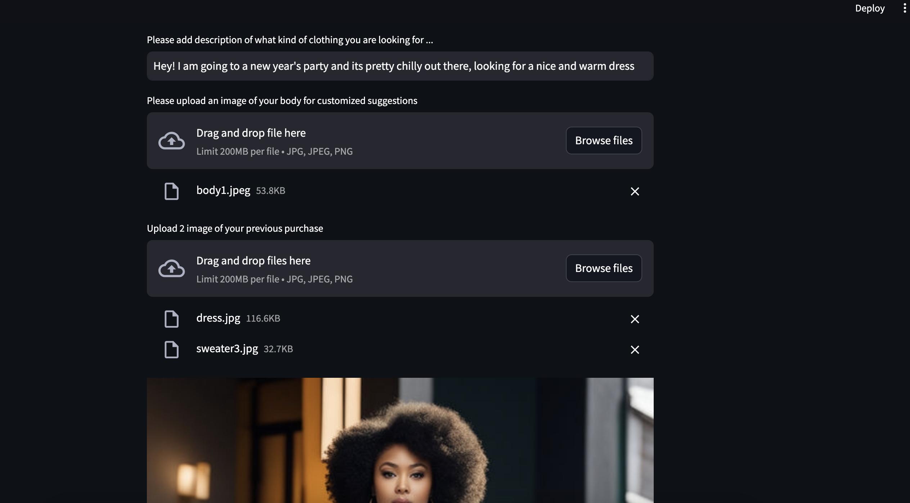
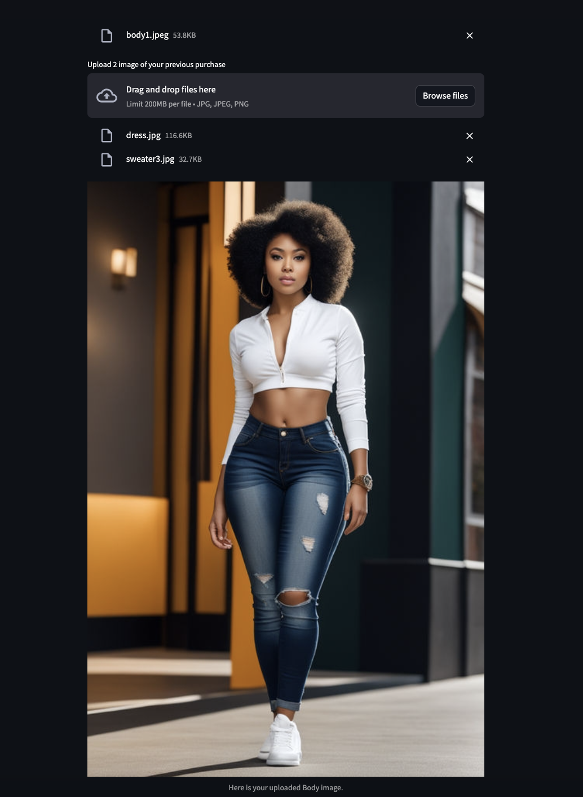
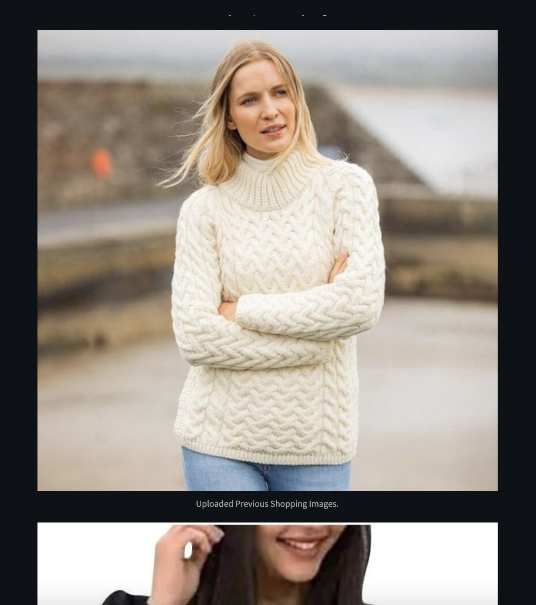
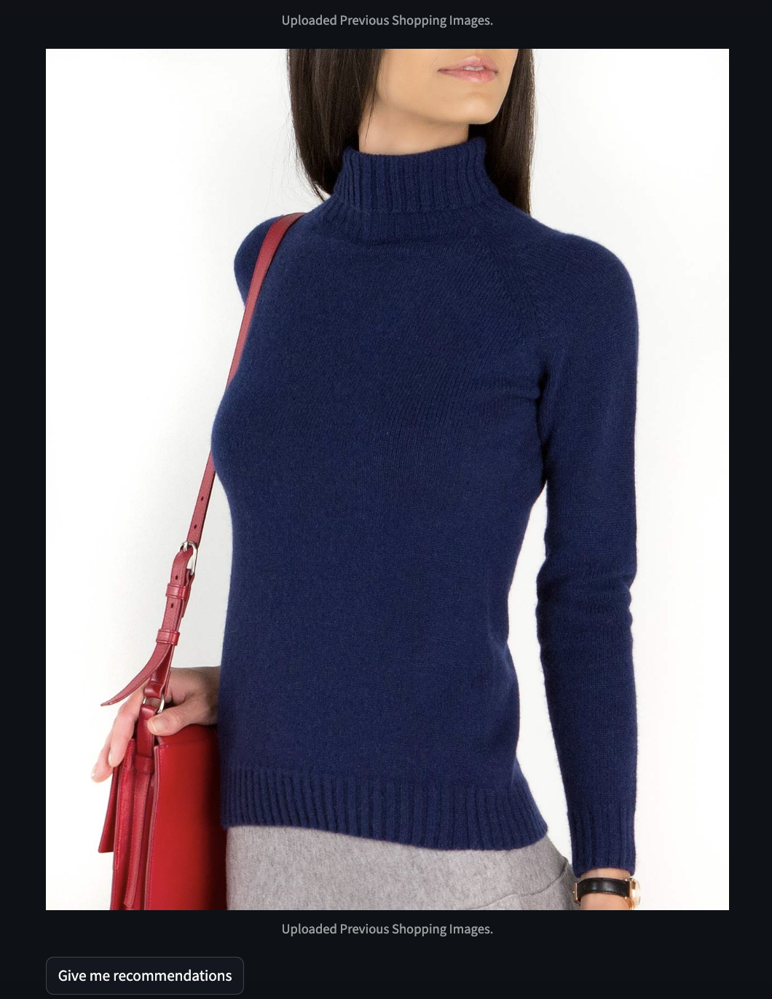
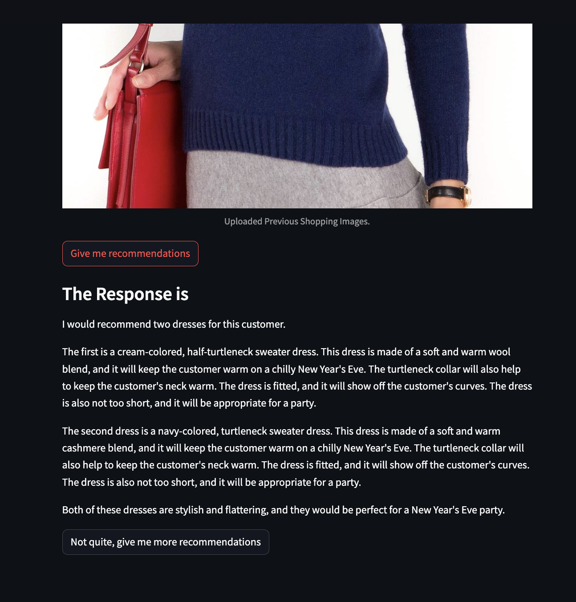
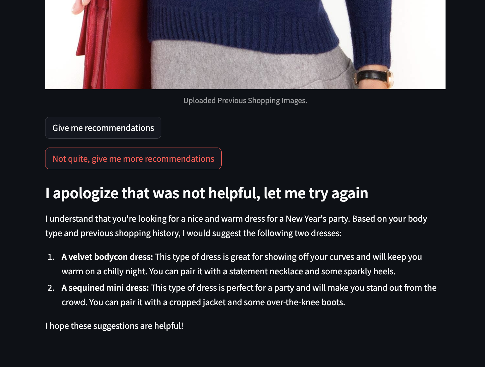

# Personalized Clothing Recommendation Application built using Gemini-Vision-Pro LLM

_Keywords_ - Gemini Vision, LLM, Streamlit, NLP, chatbot, personalization, recommendation system, virtual environment

## Context 

Natural Language Models have recently shown remarkable capabilities in comprehending human needs, preferences, behavior and emotions.   
We leverage that in demonstrating the future of personalized recommendation systems.  
We build a personalized clothing recommendation application using Gemini-Vision-Pro LLM and Streamlit. It uses images of customer's body type as well as images of the items previously purchased to give personalized recommendations to the customer in real-time.   

Note that - 
1. This model could be fine-tuned with large inventory data on platforms like _generative_ to give business relevant recommendations.  
2. This is currently an image-to-text model from Gemini initial release, but Gemini (as well as other LLMs) would be soon capable of image-to-image communication, that could be a game changer compared to current systems.  

## Method 

Step 1 : Generate API key from Gemini (unique to each user).  

Step 2 : Create virtual environment with requirements.txt file.  

Step 3 : Make a folder with customer's previous purchase images and personal body image.  

Note that in deployment, this would be recovered from a cloud bucket (like Amazon S3) and body details taken in real-time from the customer.  

Step 4 : Activate the virtual environment in command line using - conda activate name_of_your_venv.  

Step 5 : Make sure you have personalized_rec.py file in your current directory.  

Step 6 : Launch the application by running this in command line - streamlit run personalized_rec.py.  

Step 7 : Add a text prompt about what you want from the recommendation system.  

Step 8 : Upload 1 body type image and 2 previous history images on the application interface that is just launched (from the folder made in Step 3).  

Step 9 : Hit 'Give me recommendations' button and 'Not quite, give me more recommendations' button if you are not satisfied with the results.  

Step 10 : Exit the app from the terminal by pressing Ctrl+C.   

## Demo 
1. Launching the application from command line 

2. Adding description of what I am looking for in the store (in natural language text) 

3. Uploading body type image

4. Uploading previous purchase images

5. Hit 'Give me Recommendations' and see the LLM response

6. Hit 'Not quite, give me more recommendations' if not satisfied

